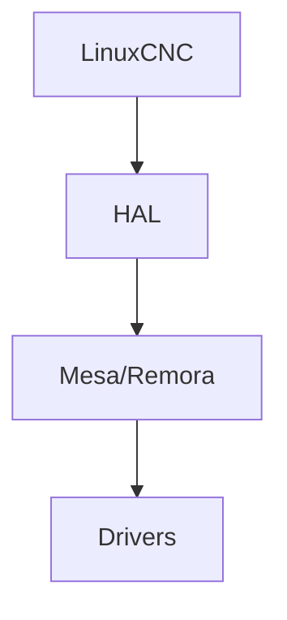

## Introducción

{{INTRO}}

### Configuración INI

```ini
{{INI_EXAMPLE}}
```

### Configuración HAL comentada línea por línea

```hal
{{HAL_EXAMPLE}}
```

### Para tu PrintNC v4

{{PRINTNC_NOTE}}

### Diagrama



### Checklist de fallas

- {{FAIL1}}
- {{FAIL2}}

**Hardware aplicable:** Mesa 7i96S, Remora NVEM
**Próximo paso:** {{NEXT}}
