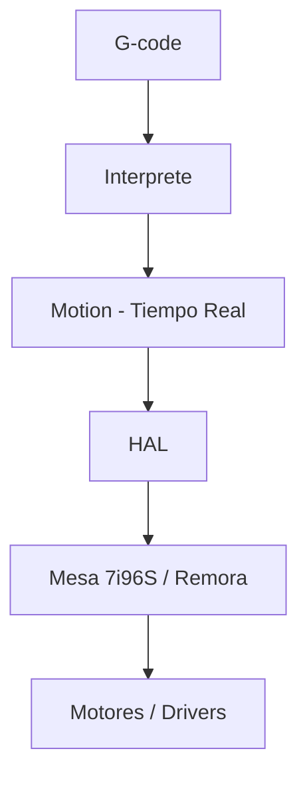

LinuxCNC no es un "sender" de G-code como GRBL. Es un controlador de máquina completo que corre con un kernel de tiempo real en Linux.

### Arquitectura en 3 capas

1.  **Tiempo real (RT):** lee encoders, genera step/dir, PID. Corre cada 1ms o menos.
2.  **HAL (Hardware Abstraction Layer):** cables virtuales que conectan pines. Es el corazón.
3.  **Usuario:** interfaz Axis, G-code, etc.

**Para tu PrintNC v4:** necesitas control determinista de 3-5 ejes + husillo. GRBL se queda corto en homing avanzado, kinematics y THC. LinuxCNC es overkill al inicio, pero te deja crecer a 5 ejes sin cambiar de software.

### Conceptos que debes dominar

- **Joint vs Axis:** Joint es motor físico, Axis es eje cartesiano. En trivkins son 1:1, en 5 ejes no.
- **INI:** tu máquina en texto. Velocidades, límites, homing.
- **HAL:** cómo está cableado todo por software.
