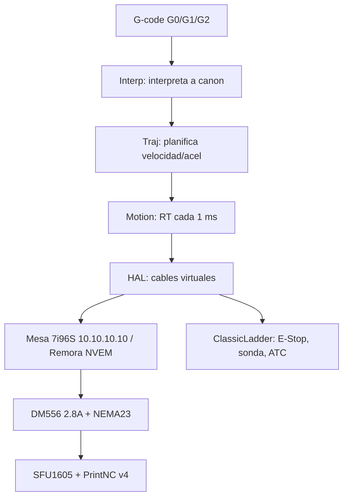
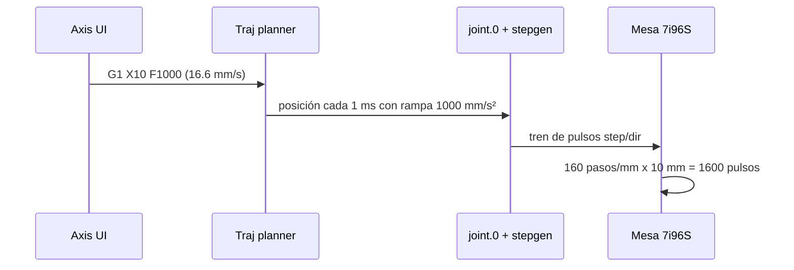

LinuxCNC no es un "sender" de G-code como UGS, Candle o grblHAL. Es un **control de máquina completo**: interpreta G-code, planifica trayectorias, genera pulsos en tiempo real y gestiona seguridad, todo en un PC con Linux + kernel PREEMPT-RT.

Si vienes de GRBL / FluidNC: olvida la idea de "placa que lo hace todo". Aquí el PC es el controlador y la tarjeta (Mesa 7i96S, Remora NVEM) es solo la interfaz rápida hacia los drivers.

## LinuxCNC vs GRBL en una tabla

| Tema | GRBL / FluidNC / grblHAL | LinuxCNC |
|---|---|---|
| Dónde corre | Microcontrolador (ESP32, STM32) | PC Linux + kernel tiempo real |
| Ejes | 3-5, kinematics limitadas | 9 joints, kinematics completas, RTCP |
| Pulsos | 30-100 kHz | 100 kHz - 4 MHz con Mesa por Ethernet |
| Homing | Básico, un switch por eje | Secuencias por eje, home-to-index, gantry con 2 motores |
| Ladder / THC / ATC | No o con parches | ClassicLadder, THC, tool-table integrados |
| Recuperación de fallo | Reinicias y rezas | `halshow`, `halscope`, logs en vivo |
| Curva aprendizaje | 1 tarde | 1 fin de semana para mover, 1 mes para dominar |

**Regla práctica:** si tu PrintNC v4 solo va a cortar madera blanda a 3000 mm/min, GRBL te sirve. Si quieres aluminio, husillo 2.2 kW, 5 ejes futuros, THC para plasma o roscado rígido, quédate en LinuxCNC.

## Arquitectura en 3 capas (lo que realmente importa)



1.  **No-RT (usuario):** Axis, G-code, MDI. Si se cuelga, la máquina no se cae.
2.  **RT (motion + HAL):** corre cada `SERVO_PERIOD = 1000000 ns` (1 ms). Genera step/dir, cierra PID, vigila límites.
3.  **HAL:** lista de `loadrt`, `addf`, `net`. Todo es un pin conectable. Si lo entiendes, puedes diagnosticar todo sin osciloscopio.

### Qué pasa cuando mandas `G1 X10 F1000`



Ese `160 pasos/mm` no es magia, es tu mecánica PrintNC estándar:

> Motor 200 pasos/rev x 8 microsteps (DM556 SW5=OFF SW6=ON SW7=ON) = 1600 pulsos/rev / 10 mm paso SFU1605 = **160 pasos/mm**.

## Tu primer INI real para PrintNC v4 (copiar/pegar)

Este es el mínimo que funciona. Cada línea comentada para que no copies a ciegas:

```ini
[EMC]
# Nombre que aparece en Axis. Úsalo para versionar: v4-mesa-01, v4-mesa-02...
MACHINE = PrintNC v4 - Mesa 7i96S
DEBUG = 0

[DISPLAY]
DISPLAY = axis
# Tiempo de refresco UI. 0.1 s es suficiente, no lo bajes.
CYCLE_TIME = 0.1

[TRAJ]
AXES = 3
COORDINATES = X Y Z
LINEAR_UNITS = mm
ANGULAR_UNITS = degree
# 150 mm/s = 9000 mm/min. PrintNC con SFU1605 lo soporta, empieza en 80 si dudas.
MAX_LINEAR_VELOCITY = 150
DEFAULT_LINEAR_VELOCITY = 50

[EMCMOT]
# 1 ms = 1 kHz servo. Estándar con Mesa Ethernet. No toques sin medir latencia.
SERVO_PERIOD = 1000000
EMCMOT = motmod
COMM_TIMEOUT = 1.0

# Eje X PrintNC: SFU1605 (10 mm/rev) + DM556 a 2.8A + NEMA23 3 Nm
[JOINT_0]
TYPE = LINEAR
HOME = 0.0
# 160 = (200*8)/10. Si pones 16 microsteps -> 320. Calcula siempre así.
SCALE = 160
MIN_LIMIT = -310.0
MAX_LIMIT = 310.0
MAX_VELOCITY = 150.0
# 1000 mm/s2 es agresivo pero OK en PrintNC bien armada. Prueba 500 primero.
MAX_ACCELERATION = 1000.0
# Regla de oro: 25% mayor que MAX_ACCEL para que stepgen no se quede corto.
STEPGEN_MAXACCEL = 1250.0
HOME_SEARCH_VEL = -20.0
HOME_LATCH_VEL = -2.0
HOME_FINAL_VEL = 20.0
HOME_OFFSET = 0.0
HOME_IGNORE_LIMITS = YES
```

> Si usas Remora NVEM (STM32F207) en vez de Mesa, el INI es idéntico. Solo cambia el HAL y `SCALE` se mantiene en 160 porque la mecánica no cambia.

## Tu primer HAL explicado línea por línea

```hal
# 1. Driver Mesa por Ethernet. IP fija 10.10.10.10, 5 stepgens para XYZ + A futuro
loadrt hm2_eth board_ip="10.10.10.10" config="num_encoders=0 num_pwmgens=0 num_stepgens=5"

# 2. Hilo RT de 1 ms donde corre motion + stepgen
addf hm2_7i96s.0.read servo-thread
addf motion-command-handler servo-thread
addf motion-controller servo-thread
addf hm2_7i96s.0.write servo-thread

# 3. X: joint.0 pide pulsos -> stepgen.00 los genera
# SCALE ya viene del INI, aquí solo cableamos posición
net x-pos-cmd <= joint.0.motor-pos-cmd
net x-pos-cmd => hm2_7i96s.0.stepgen.00.position-cmd
net x-pos-fb <= hm2_7i96s.0.stepgen.00.position-fb
net x-pos-fb => joint.0.motor-pos-fb

# 4. Habilitación: LinuxCNC habilita -> Mesa habilita DM556 (pin ENA)
net x-enable <= joint.0.amp-enable-out
net x-enable => hm2_7i96s.0.stepgen.00.enable

# 5. E-Stop físico a entrada 00: si se abre, LinuxCNC entra en ESTOP
net estop-loop <= hm2_7i96s.0.gpio.000.in-not
net estop-loop => iocontrol.0.emc-enable-in
```

Prueba en vivo sin mover nada:

```bash
halshow &
# Busca hm2_7i96s.0.stepgen.00.enable -> fuerza TRUE y oirás el DM556 bloquear el motor
halscope &
# Grafica joint.0.motor-pos-cmd vs position-fb: deben superponerse
```

Si `position-fb` se queda atrás, sube `STEPGEN_MAXACCEL` o baja `MAX_ACCELERATION`. El 90% de los "pierde pasos" es eso, no corriente.

## Joint vs Axis (el error que todos cometen)

*   **Joint = motor físico** (`joint.0`, `joint.1`). Tiene SCALE, límites, homing.
*   **Axis = eje cartesiano** (`X`, `Y`, `Z`). Es lo que programas en G-code.

En PrintNC cartesiana 3 ejes son 1:1 y puedes ignorarlo. En gantry con doble Y (Y + Y2) o en 5 ejes con kinematics, tienes 4-5 joints para 3 ejes. Homing se hace por joint, el G-code se mueve por axis. Cuando veas `homing joint 1 failed`, busca el motor Y2, no el "eje Y".

## Cuándo NO usar LinuxCNC

Sé honesto contigo:

*   Solo tienes un portátil sin Ethernet y sin PC dedicado: usa FluidNC.
*   Quieres grabar PCB una vez al mes: grblHAL sobra.
*   Te da pánico el terminal Linux: empieza con Remora + WiFi, luego migra a Mesa.

Para todo lo demás en PrintNC v4, LinuxCNC te ahorra cambiar de electrónica en 2 años.

## Hardware aplicable

*   **Recomendado:** PrintNC v4 + Mesa 7i96S (IP 10.10.10.10) + DM556 a 2.8A + NEMA23 + SFU1605 + husillo 2.2 kW. SCALE 160 pasos/mm en XYZ.
*   **Alternativo:** Remora NVEM STM32F207 + mismos drivers/mecánica. Mismo INI, HAL con `loadrt Remora-eth`.
*   **PC:** cualquier i3/i5 con Debian 12 + kernel PREEMPT-RT, Ethernet dedicada a la Mesa, nada de WiFi para motion.

## Próximo paso

Ya sabes qué es y por qué. Ahora instala de verdad: [Instalación Debian 12 + PREEMPT-RT](../basico/02-instalacion) y luego entiende [INI y HAL sin miedo](../basico/03-conceptos-ini-hal). No edites tu máquina real hasta pasar por [Primer movimiento](../basico/04-primer-movimiento).
