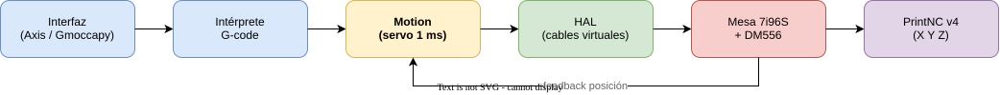

LinuxCNC no es un programa que "manda G-code al puerto". Es un **sistema de control completo**: lee tu programa, calcula movimientos coordinados cada milisegundo y los convierte en señales eléctricas puntuales para los drivers.

Si entiendes esta cadena una vez, todo lo demás encaja: por qué necesita un PC con tiempo real, qué hace cada archivo de configuración y dónde mirar cuando algo no se mueve.

## La cadena completa en 30 segundos

Cada movimiento que ejecuta tu PrintNC recorre siempre el mismo camino:

**Interfaz (GUI) → Intérprete G-code → Motion → HAL → Driver → Hardware → Máquina**



1. **Interfaz:** lo que ves en pantalla (Axis, Gmoccapy, QtDragon). Carga el programa, muestra posición, botones de home y overrides.
2. **Intérprete:** traduce cada línea de G-code (`G1 X20 F600`) a órdenes de movimiento interno: "recta hasta X=20 a 600 mm/min".
3. **Motion:** el planificador. Coordina los ejes para que lleguen a la vez, respeta aceleraciones y límites, y cada milisegundo dice "cada motor debería estar aquí".
4. **HAL (Hardware Abstraction Layer):** la centralita de cables virtuales. Conecta la orden de Motion con el pin físico que corresponda.
5. **Driver + hardware:** Mesa 7i96S o Remora NVEM convierten esa orden en pulsos de paso/dirección, 0-10 V de husillo o salidas de relé.
6. **Máquina:** motores, husillo SFU1605 y estructura ejecutan el movimiento.

> Si algo falla, la pregunta siempre es: ¿en qué eslabón se cortó la cadena? Esta lógica es la base de todo diagnóstico posterior.

*Diagrama editable: `src/assets/docs/diagrams/linuxcnc-cadena-control.drawio` (draw.io, vía MCP `@drawio/mcp`). Para editarlo, ábrelo en [app.diagrams.net](https://app.diagrams.net/) y exporta de nuevo a SVG con el mismo nombre.*

## Componentes principales, sin humo

- **GUI (interfaz):** no mueve nada por sí misma. Solo pide y muestra. Puedes cambiar de Axis a Gmoccapy sin tocar la configuración de movimiento.
- **Motion:** el único que sabe de cinemática y trayectorias. Trabaja en tiempo real: si se retrasa, la pieza sale mal. Por eso no corre en Windows normal.
- **HAL:** cables por software. Con `net` conectas una salida de Motion a una entrada del hardware, igual que conectarías un cable físico. Todo lo que es "esta entrada activa aquel relé" vive aquí.
- **INI:** el archivo de datos de tu máquina: recorridos, velocidades máximas, escala de cada eje, retardos. No contiene lógica, solo números.
- **Drivers (realtime):** pequeños programas cargados en el núcleo (`hm2_eth` para Mesa, `remora` para Remora, `stepgen` para paso por software). Hablan con el hardware a ritmo estricto.
- **Realtime (tiempo real):** la garantía de que Motion y los drivers se ejecutan cada 1 ms exacto, pase lo que pase en el PC (ventanas abiertas, USB, red).

En una PrintNC cartesiana la cosa es simple: `joint 0 = eje X`, `joint 1 = eje Y`, `joint 2 = eje Z`. Cada `joint` es un motor físico.

## Los 4 archivos que forman una máquina

Toda configuración LinuxCNC vive en una carpeta, normalmente en `~/linuxcnc/configs/mi-maquina/`. Con cuatro archivos basta para entenderla:

- `mi-maquina.ini` — **qué** es la máquina (números y rutas).
- `mi-maquina.hal` — **cómo** se conecta (cables virtuales).
- `custom.hal` — tus añadidos (sonda, relés extra) sin tocar el archivo generado por el configurador.
- `tool.tbl` — la tabla de herramientas (diámetros y largos).

### INI comentado línea por línea

Extracto simplificado para PrintNC v4 (SFU1605, 160 steps/mm). No es una configuración completa — la completa la crearás en el capítulo 09 — pero cada línea es sintaxis real:

```ini
[EMC]
MACHINE = PrintNC-v4-demo      ; nombre que aparece en la ventana
DEBUG = 0                      ; 0 = normal, >0 solo para depurar

[DISPLAY]
DISPLAY = axis                 ; interfaz gráfica a usar (Axis)
POSITION_OFFSET = RELATIVE      ; muestra posición respecto a cero pieza
POSITION_FEEDBACK = ACTUAL      ; muestra posición real, no la ordenada

[TASK]
TASK = milltask                ; tarea de fresado estándar
CYCLE_TIME = 0.010             ; cada 10 ms revisa mensajes GUI <-> Motion

[RS274NGC]
PARAMETER_FILE = linuxcnc.var  ; guarda variables #5000 y G54 entre sesiones

[EMCMOT]
EMCMOT = motmod                ; módulo de motion en tiempo real
COMM_TIMEOUT = 1.0             ; si Motion no responde en 1 s, aborta
SERVO_PERIOD = 1000000         ; 1 000 000 ns = 1 ms = 1000 Hz (ritmo servo)

[HAL]
HALFILE = mi-maquina.hal       ; conexiones principales
HALFILE = custom.hal           ; tus añadidos, se carga después

[TRAJ]
AXES = 3                       ; ejes cartesianos: X Y Z
COORDINATES = X Y Z            ; letras que entiende el intérprete
MAX_VELOCITY = 66.6            ; 66.6 mm/s = 4000 mm/min, techo de la máquina
DEFAULT_VELOCITY = 16.6        ; velocidad por defecto si el G-code no da F

; --- Eje X: motor + husillo SFU1605 (paso 5 mm) ---
[JOINT_0]
TYPE = LINEAR                  ; articulación lineal (no rotativa)
HOME = 0.0                     ; tras home, el cero máquina queda en 0
MIN_LIMIT = 0.0                ; tope software inferior (mm)
MAX_LIMIT = 600.0              ; tope software superior: recorrido X 600 mm
MAX_VELOCITY = 66.6            ; tope de este joint en mm/s
MAX_ACCELERATION = 800.0       ; aceleración máxima en mm/s^2
SCALE = 160                    ; 160 pasos por mm (200 pasos/rev x 8 micropasos / 5 mm + reductora según tu montaje)
STEPGEN_MAXACCEL = 1000.0      ; el generador de pasos debe poder acelerar más que el joint
HOME_OFFSET = 0.0              ; desplazamiento entre sensor y cero máquina
HOME_SEARCH_VEL = 10.0         ; velocidad buscando el sensor (mm/s)
HOME_LATCH_VEL = 2.0           ; velocidad lenta para fijar el punto exacto

[AXIS_X]
MIN_LIMIT = 0.0                ; los límites se repiten aquí para el planificador
MAX_LIMIT = 600.0
MAX_VELOCITY = 66.6
MAX_ACCELERATION = 800.0
```

Idea clave: si cambias mecánica (polea, micropasos, husillo), solo cambia `SCALE` y límites. Si cambias comportamiento (velocidad, aceleración), cambias `MAX_VELOCITY` / `MAX_ACCELERATION`. No toques lo demás hasta el capítulo de calibración.

### HAL comentado línea por línea

El HAL conecta la orden calculada por Motion con el hardware. Ejemplo mínimo legible (software `stepgen`; con Mesa 7i96S el `loadrt` cambia a `hm2_eth`, ver capítulo 11):

```hal
# Carga el generador de pasos por software (1 canal de ejemplo)
loadrt stepgen step_type=0 num_chan=1
#  step_type=0 = pulsos paso/dirección (drivers DM556)
#  num_chan=1 = solo un motor en este ejemplo mínimo

# Carga el hilo de tiempo real y añade las funciones en orden
addf stepgen.make-pulses servo-thread
#  servo-thread se ejecuta cada 1 ms (SERVO_PERIOD del INI)
addf stepgen.capture-position servo-thread
addf motion-command-handler servo-thread
addf motion-controller servo-thread
#  el orden importa: primero genera pulsos, luego Motion calcula el siguiente punto

# Escala del eje X: los mismos 160 steps/mm del INI
setp stepgen.0.position-scale 160
#  convierte "mm que pide Motion" en "pulsos que pide el driver"

# Conecta la orden de Motion con el generador de pasos
net x-pos-cmd joint.0.motor-pos-cmd => stepgen.0.position-cmd
#  joint.0.motor-pos-cmd = "dónde debería estar X" (sale de Motion)
#  => stepgen.0.position-cmd = entrada del generador

# Devuelve la posición medida hacia Motion (bucle cerrado a nivel de conteo)
net x-pos-fb stepgen.0.position-fb => joint.0.motor-pos-fb
#  sin este retorno Motion trabaja a ciegas y no detecta following error

# Habilitación: sin enable no hay pulsos aunque haya orden
net x-enable joint.0.amp-enable-out => stepgen.0.enable
#  cuando LinuxCNC habilita el eje, habilita el generador (y vía HAL, el pin ENABLE del DM556)
```

Con Mesa 7i96S (`10.10.10.10`) la única diferencia conceptual es la primera línea:

```hal
loadrt hm2_eth board_ip="10.10.10.10" config="num_stepgens=3"
#  carga el driver de la Mesa por Ethernet en vez del stepgen por software
#  el resto (net x-pos-cmd, net x-pos-fb, enable) sigue la misma lógica
```

Regla de oro HAL: **un `net` es un cable**. Si lo lees en voz alta ("la orden de X va al generador de X") y tiene sentido físico, está bien.

### tool.tbl en dos líneas

```txt
T1 P1 D3.175 Z0.0  ; fresa 1/8" (3.175 mm), largo medido en Z0
T2 P2 D6.0 Z-2.5   ; fresa 6 mm plana, 2.5 mm más corta que la referencia
; T = número que llamas con M6 Tn G43, P = bolsillo, D = diámetro, Z = largo
```

## Tiempo real explicado sin teoría

Tu PC hace muchas cosas a la vez: mueve el ratón, dibuja la ventana, atiende la red. Un sistema normal atiende "cuando puede": a veces en 0.1 ms, a veces en 50 ms.

Para fresar no vale "cuando pueda". Si Motion debe dar un paso cada 1 ms y un día tarda 5 ms, el motor vibra, pierde pasos o la trayectoria se deforma.

**Tiempo real = puntualidad garantizada.** LinuxCNC reserva una parte del sistema que se ejecuta cada periodo exacto, aunque el resto del PC esté ocupado.

## Servo thread y base thread

LinuxCNC organiza el trabajo puntual en "hilos" (`threads`):

- **servo-thread (el importante):** se ejecuta cada `SERVO_PERIOD`, típicamente **1 ms (1000 Hz)**. Aquí viven Motion y la lectura/escritura a Mesa/Remora. Todo lo que define la trayectoria pasa por aquí.
- **base-thread (el histórico):** se ejecutaba mucho más rápido (20-50 kHz) solo para generar pulsos de paso por puerto paralelo. En PCs modernos con **Mesa 7i96S o Remora el hardware genera los pulsos**, así que el base-thread ya no se usa. Solo lo verás si rescatas una configuración vieja por puerto paralelo.

Regla práctica: PrintNC + Mesa/Remora = solo te importa el servo-thread a 1 ms.

## Latencia: el número que decide si tu PC sirve

**Latencia** es el retraso máximo que el PC introduce en una tarea de tiempo real. Se mide en nanosegundos o microsegundos con el `latency test`.

- Latencia de 10 µs en un servo de 1000 µs (1 ms): margen enorme, todo bien.
- Latencia de 800 µs en un servo de 1000 µs: al límite, cualquier pico rompe la puntualidad.

Por eso el capítulo 05 te hará correr el latency test con la máquina trabajando (moviendo ventanas, cargando la red): quieres saber el **peor caso**, no el caso bonito en reposo.

## PREEMPT_RT: el parche que vuelve puntual a Linux

Linux normal no es de tiempo real. **PREEMPT_RT** es un conjunto de cambios al núcleo que le permite interrumpir cualquier tarea para atender a tiempo a Motion.

En la práctica para ti significa una sola cosa:

> **Usa la ISO oficial de LinuxCNC con Debian + PREEMPT_RT ya incluido.** No intentes "añadir tiempo real" a tu Ubuntu de todos los días.

La instalación paso a paso va en el capítulo 07. Aquí basta con saber que sin ese núcleo, LinuxCNC se niega a arrancar el modo realtime.

## Sigue un G1 desde la pantalla hasta el motor

Para fijar la cadena, sigue `G1 X20 F600` en una PrintNC con Mesa (es el recorrido del diagrama de arriba):

1. Escribes `G1 X20 F600` en MDI y pulsas Enter (GUI).
2. El intérprete lo convierte en "recta a X=20 a 10 mm/s" (intérprete).
3. Motion calcula 1000 puntos intermedios (uno por cada ms) respetando aceleración de 800 mm/s² (Motion + servo-thread).
4. Cada punto viaja por el cable HAL `x-pos-cmd` hasta el driver `hm2_eth` (HAL).
5. La Mesa 7i96S (`10.10.10.10`) genera los pulsos: 20 mm x 160 steps/mm = 3200 pulsos al DM556 (driver + hardware).
6. El DM556 (2.8A) energiza el NEMA23, el SFU1605 convierte giro en avance y X llega a 20.00 (máquina).
7. El contador de pasos vuelve por `x-pos-fb` a Motion, que comprueba "¿llegó donde dije?" (feedback).

Si X no se mueve, ya sabes dónde preguntar: ¿llegó la orden a HAL (`HAL Show`)? ¿sale algo por la Mesa? ¿el DM556 tiene enable y corriente? Ese orden es diagnosticar.

## Errores frecuentes

- **Tratar el INI como código.** El INI son datos. La lógica vive en el HAL. Si "no hace lo que quiero", el 80 % de las veces es un `net` mal conectado, no un número del INI.
- **Editar el HAL generado sin copiar a custom.hal.** El configurador (PnCconf) sobrescribe `mi-maquina.hal`. Tus inventos van en `custom.hal` o los pierdes.
- **Cambiar SCALE a ojo.** SCALE sale de cálculo (pasos, micropasos, paso de husillo), no de prueba-error. Se calcula, luego se verifica con regla (capítulo 09).
- **Pedir más velocidad que STEPGEN_MAXACCEL.** Si el joint puede acelerar a 800 pero el generador solo a 500, el eje se queda atrás y salta `following error`. El generador siempre debe poder más que el joint.
- **Culpar a la Mesa cuando es latencia.** Tirones aleatorios + PC usado con WiFi y ahorro de energía activado = mide latencia antes de tocar el HAL.

## Hardware aplicable

- PC con Debian + PREEMPT_RT (cualquier PC válido del capítulo 05).
- PrintNC v4 de ejemplo: recorridos 600 x 600 x 300 mm, SFU1605, 160 steps/mm, drivers DM556 a 2.8A.
- Mesa 7i96S en `10.10.10.10` y Remora NVEM (STM32F207) como ejemplos de driver: ambos cuelgan del mismo Motion y HAL, solo cambia el `loadrt`.

## Próximo paso

- Continuar con [05. Elegir computadora para LinuxCNC](./05-elegir-computadora-linuxcnc): requisitos reales, latency test y hardware a evitar, para que el servo-thread de este capítulo tenga dónde correr puntual.
